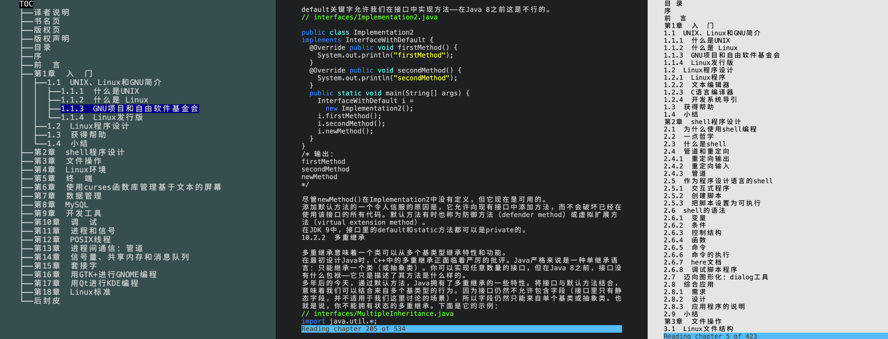

# GoRead

GoRead is a terminal/CLI EPUB reader written in Golang, inspired by [epr](https://github.com/wustho/epr).



*[中文文档](./docs/README-CN.md)*

## Features

- Remembers last read file (just run `goread` without arguments)
- Remembers last read state for each file (state saved in `$HOME/.config/goread/config` or `$HOME/.goread`)
- Code highlighting
- Adjustable text area width
- Adapts to terminal size changes
- EPUB3 support (without audio)
- Vim-style key bindings
- Image viewing support (using system default image viewer)
- Dark/light color schemes (depending on terminal color capabilities)
- Cross-platform

## Roadmap
- Support for mobi format

## Usage

```
goread             Read the last opened epub
goread EPUBFILE    Read specified EPUBFILE
goread STRINGS     Read file matching STRINGS from history
goread NUMBER      Read file numbered NUMBER from history
```

## Options

```
-r              Print reading history
-d              Export epub content
-h, --help      Print help information
```

## Key Bindings

```
Help             : ?
Quit             : q
Table of Contents: t
Next Chapter     : n
Previous Chapter : N
Search           : /
Scroll Down      : j
Scroll Up        : k
Half Page Up     : C-u
Half Page Down   : C-d
Chapter Start    : g
Chapter End      : G
Open Image       : o
Increase Width   : +
Decrease Width   : -
Metadata         : m
Toggle Color     : c
```

### Dependencies

- Go 1.16 or higher
- [tcell](https://github.com/gdamore/tcell) - Terminal handling library
- [tview](https://github.com/rivo/tview) - Terminal UI library

### Building

See [Makefile](./Makefile) for details
```bash
# Build for current platform
make build

# Build for specific platforms
make windows
make linux
make macos

# Build for all platforms
make all

# Clean build artifacts
make clean
```

## License

MIT
