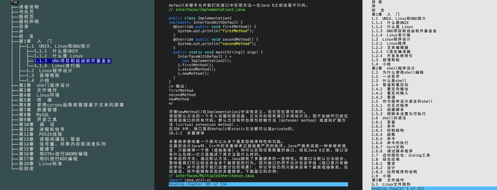

# GoRead

GoRead 是一个用 Golang 编写的终端/CLI EPUB 阅读器，受 [epr](https://github.com/wustho/epr) 启发。



## 特性

- 记住上次阅读的文件（直接运行 `goread` 无需参数）
- 记住每个文件的最后阅读状态（每个文件的状态保存在 `$HOME/.config/goread/config` 或 `$HOME/.goread`）
- 代码高亮
- 可调整文本区域宽度
- 适应终端大小调整
- 支持 EPUB3（不支持音频）
- 支持 vim 风格的按键绑定
- 支持打开图片（使用系统默认图片查看器）
- 深色/浅色配色方案（取决于终端颜色能力）
- 跨平台

## Roadmap
- 支持 mobi 格式

## 使用方法

```
goread             读取上次阅读的 epub
goread EPUBFILE    读取指定的 EPUBFILE
goread STRINGS     从历史记录中读取匹配 STRINGS 的文件
goread NUMBER      从历史记录中读取编号为 NUMBER 的文件
```

## 选项

```
-r              打印阅读历史
-d              导出 epub 内容
-h, --help      打印帮助信息
```

## 按键绑定

```
帮助             : ?
退出             : q
目录             : t
下一章节         : n
上一章节         : N
搜索             : /
向下滚动         : j
向上滚动         : k
向上半屏         : C-u
向下半屏         : C-d
章节开始         : g
章节结束         : G
打开图片         : o
增大宽度         : +
减小宽度         : -
元数据           : m
切换配色方案     : c
```

### 依赖

- Go 1.16 或更高版本
- [tcell](https://github.com/gdamore/tcell) - 终端处理库
- [tview](https://github.com/rivo/tview) - 终端 UI 库

### 构建

具体可以参考 [Makefile](./Makefile)
```bash
# 构建当前平台
make build

# 构建指定平台
make windows
make linux
make macos

# 构建所有平台
make all

# 清理构建产物
make clean
```

## 许可证

MIT
